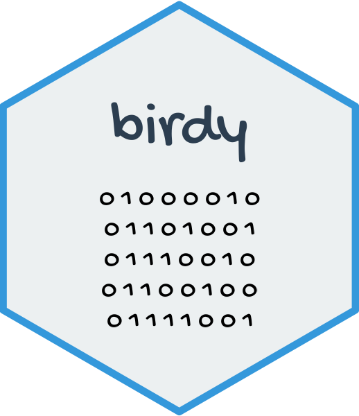
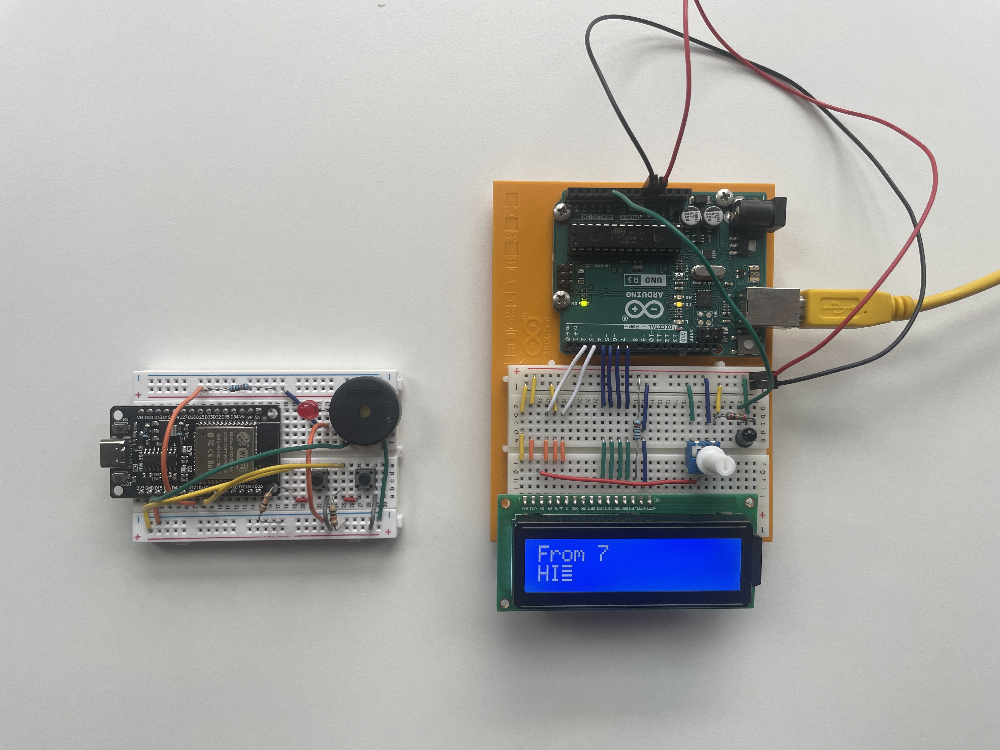
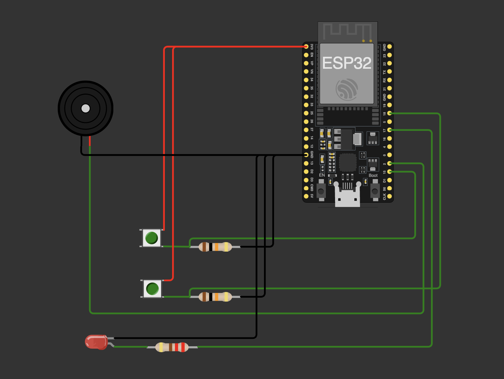
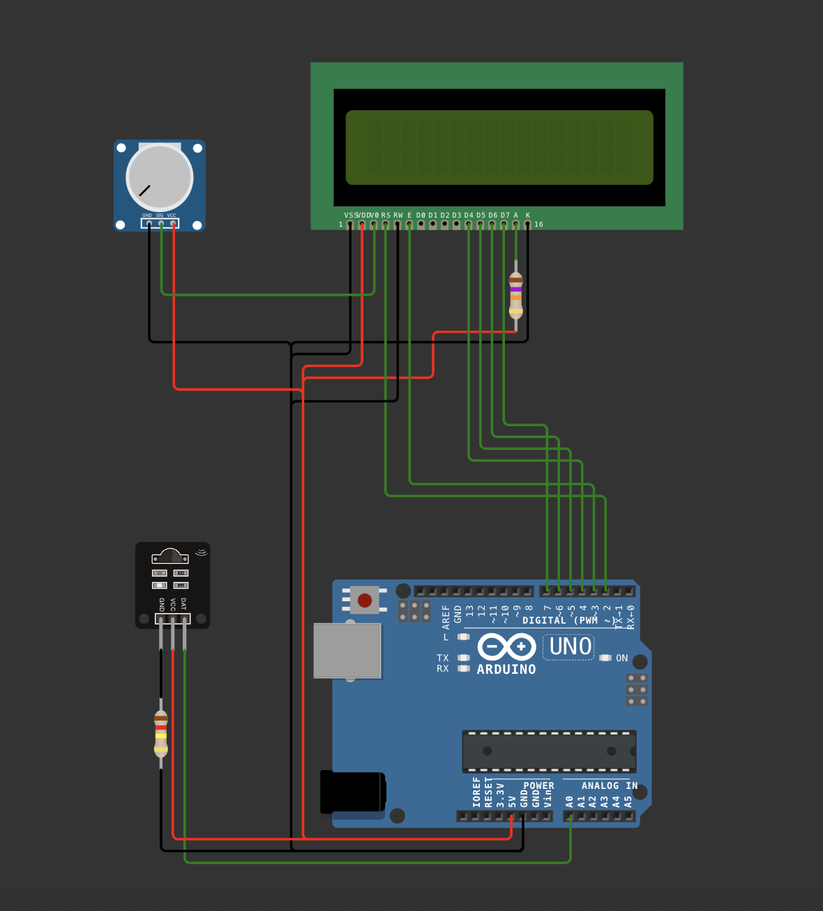

# birdy </a>

Birdy is an communication system built using Arduino.

## More information

Birdy is comprised of two components:

- Bird
  - Handheld device (ESP32) that encodes a message in binary light pulses.
- Nest
  - Microcontroller (Arduino UNO R3) that decodes the light signal and displays a message from each user on an LCD screen.

## System

This is a photo of the Arduino and ESP setup. It demonstrates a simple example of sending the message "HI" as user 7.

## Bird

Below demonstrates how to set up the Bird – the image previews the contents of [`diagram.json`](bird/diagram.json) located in the [bird](bird) directory.

## Nest

Below demonstrates how to set up the Nest – the image previews the contents of [`diagram.json`](nest/diagram.json) located in the [nest](nest) directory.

## License

birdy has an MIT license, as found in the [LICENSE](LICENSE) file.
